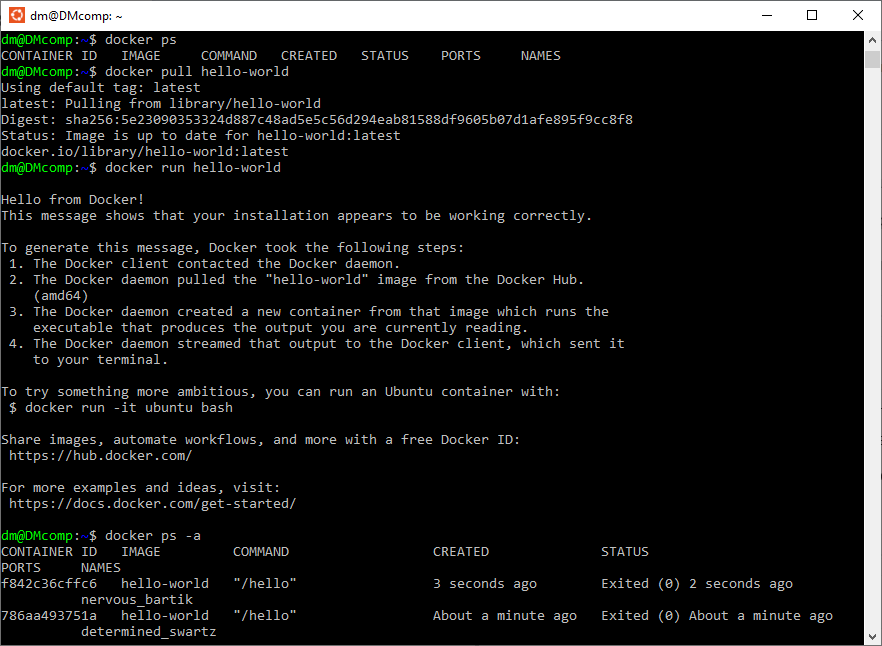
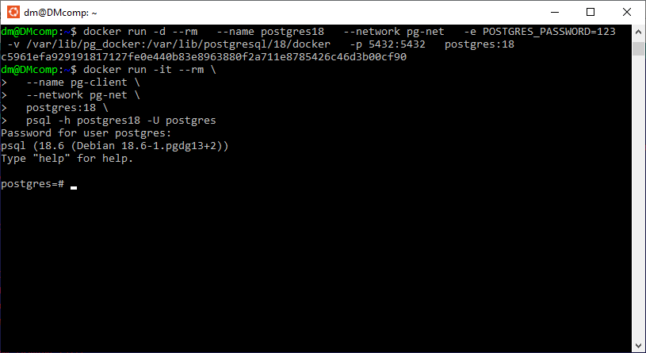
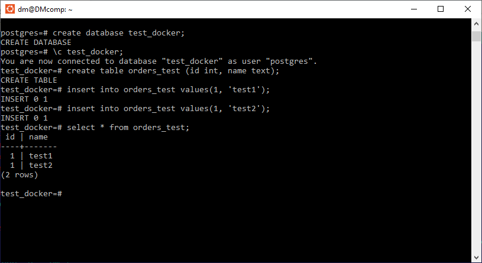
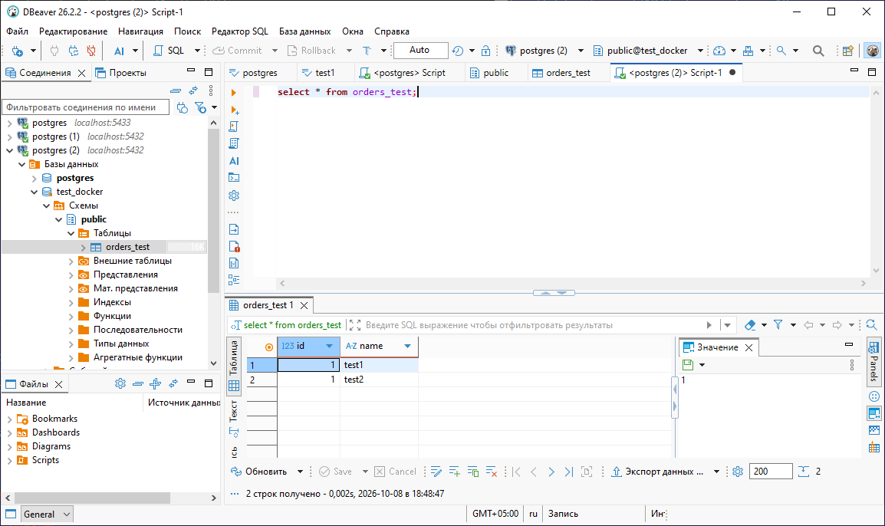
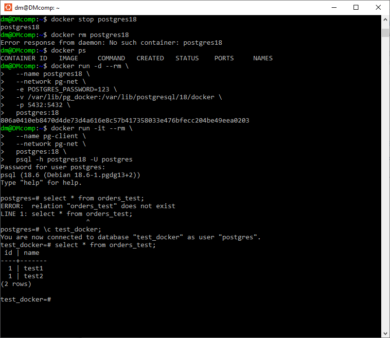
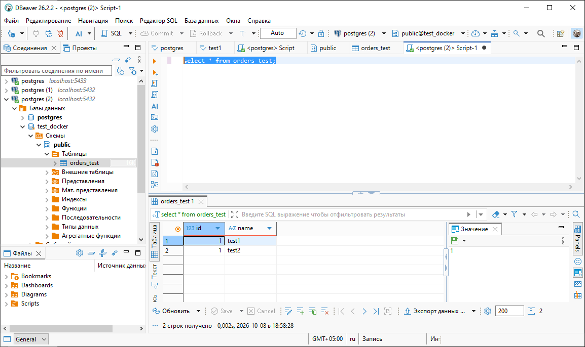

## Установка PostgreSQL // ДЗ 1
постановка задачи на https://otus.ru/learning/531261/

# 1.Создайте ВМ с Ubuntu 22.04/24.04 или подготовьте хост, на котором будет развёрнут Docker;
Устанавливаем Linux в Windows с помощью WSL
инструкции по установки смотрим на https://learn.microsoft.com/ru-ru/windows/wsl/install

```PowerShell
wsl --install
Выполняется установка: Платформа виртуальной машины
Установка "Платформа виртуальной машины" выполнена.
Выполняется установка: Подсистема Windows для Linux
Установка "Подсистема Windows для Linux" выполнена.
Выполняется установка: Подсистема Windows для Linux
[                           0,0%                           ]
```

Проблема 1. установка останавливается на 0%
решается предварительным скачиванием дистрибутива

```PowerShell
wsl --install --web-download -d Ubuntu
Загрузка: Подсистема Windows для Linux
[=============             22,8%                           ]
Загрузка: Подсистема Windows для Linux
Выполняется установка: Подсистема Windows для Linux
Не найден указанный модуль.
```

Проблема 2. "Не найден указанный модуль."
решается перегрузкой Win с включением ранее не используемых модулей,
и обновленим WSL

```PowerShell
wsl --update
Проверяется наличие обновлений.
Последняя версия подсистема Windows для Linux уже установлена.
wsl --install -d Ubuntu --web-download
Скачивание: Ubuntu
Установка: Ubuntu
Дистрибутив успешно установлен. Его можно запустить с помощью "wsl.exe -d Ubuntu"
Запуск Ubuntu...
Provisioning the new WSL instance Ubuntu
This might take a while...
Create a default Unix user account: dm
```


# 2.Установите Docker Engine;
установим докер 
```sh
curl -fsSL https://get.docker.com -o get-docker.sh && sudo sh get-docker.sh && rm get-docker.sh && sudo usermod -aG docker $USER && newgrp docker
```

проверим корректность работы и наличие контейнеров
```sh
docker ps
```

потренируемся на hello-world
```sh
docker pull hello-world
docker run hello-world
```


# 3.Создайте каталог для данных PostgreSQL на хосте: /var/lib/postgresql;
создаем каталог и накинем прав
```sh
sudo mkdir -p /var/lib/postgresql
sudo chmod 700 /var/lib/postgresql
```

# 4.Разверните контейнер с PostgreSQL, смонтировав каталог хоста в каталог данных контейнера и пробросив порт 5432 для внешнего подключения;
загрузка 18 postgres на хост 
```sh
docker pull postgres:18
```

 запуск по скрипту c урока
 --rm = после выполнения - удалить -d = в фоне  -p = проброс портов
 -v = монтируем каталог с данными в фс хоста /var/lib/postgres
 --network pg-net общая сеть 
 -it интерактивный режим с терминалом.
 -h хост подключения
 -U имя пользователя

 заявим общую сеть
```sh
sudo docker network create pg-net  
```

контейнер сервер
```sh
docker run -d --rm \
  --name postgres18 \
  --network pg-net \
  -e POSTGRES_PASSWORD=123 \
  -v /var/lib/pg_docker:/var/lib/postgresql/18/docker \
  -p 5432:5432 \
  postgres:18
```

# 5.Разверните контейнер с клиентом PostgreSQL (psql);
контейнер клиент
```sh
docker run -it --rm \
  --name pg-client \
  --network pg-net \
  postgres:18 \
  psql -h postgres18 -U postgres
```



# 6.Подключитесь из контейнера с клиентом к контейнеру с сервером; создайте таблицу orders_test и добавьте минимум 2 строки;
```sql
create database test_docker;
\c test_docker;
create table orders_test (id int, name text);
insert into orders_test values(1, 'test1');
insert into orders_test values(1, 'test2');
select * from orders_test;
```



# 7.Подключитесь к PostgreSQL с ноутбука/рабочего компьютера извне хоста (по адресу хоста и порту 5432); выполните проверочный select из таблицы orders_test;
проверим подключение с DBeaver и сделаем выборку


# 8.Остановите и удалите контейнер с сервером PostgreSQL;
```sh
docker stop postgres18
```
остановим. команда удаления не потребуется, так как был взыведен флаг rm
```sh
docker ps -a | grep postgres-server
```

# 9.Создайте контейнер с сервером заново, используя тот же смонтированный каталог данных;
```sh
docker run -d --rm \
  --name postgres18 \
  --network pg-net \
  -e POSTGRES_PASSWORD=123 \
  -v /var/lib/pg_docker:/var/lib/postgresql/18/docker \
  -p 5432:5432 \
  postgres:18
```

# 10.Подключитесь повторно из контейнера с клиентом и извне; проверьте, что строки в orders_test сохранились;
```sh
docker run -it --rm \
  --name pg-client \
  --network pg-net \
  postgres:18 \
  psql -h postgres18 -U postgres
```



