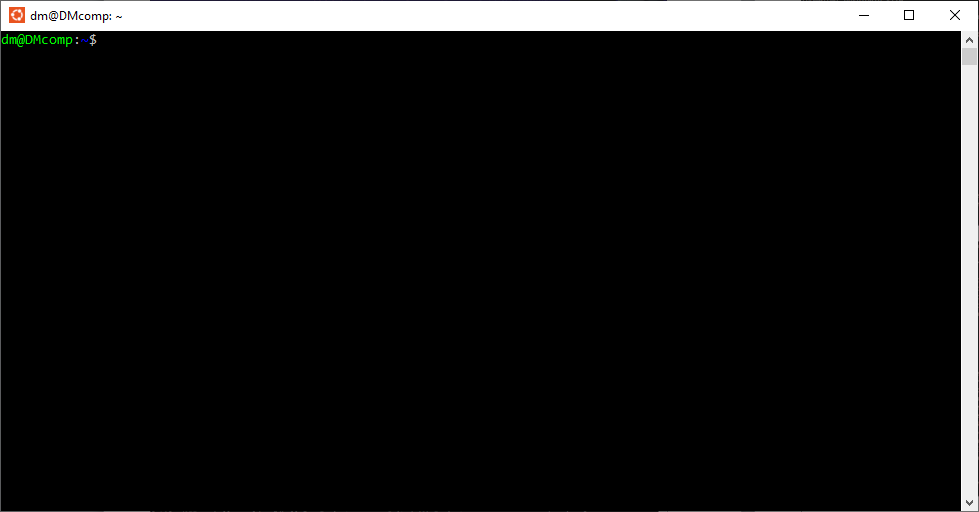

## Установка PostgreSQL // ДЗ 1
постановка задачи на https://otus.ru/learning/531261/

# 1.Создайте ВМ с Ubuntu 22.04/24.04 или подготовьте хост, на котором будет развёрнут Docker;
Установливаем Linux в Windows с помощью WSL
инструкции по установки смотрим на https://learn.microsoft.com/ru-ru/windows/wsl/install

```PowerShell
wsl --install
Выполняется установка: Платформа виртуальной машины
Установка "Платформа виртуальной машины" выполнена.
Выполняется установка: Подсистема Windows для Linux
Установка "Подсистема Windows для Linux" выполнена.
Выполняется установка: Подсистема Windows для Linux
[                           0,0%                           ]
```

Проблема 1. установка останавливается на 0%
решается предварительным скачиванием дистрибютива 

```PowerShell
wsl --install --web-download -d Ubuntu
Загрузка: Подсистема Windows для Linux
[=============             22,8%                           ]
Загрузка: Подсистема Windows для Linux
Выполняется установка: Подсистема Windows для Linux
Не найден указанный модуль.
```

Проблема 2. "Не найден указанный модуль."
решается перегрузкой Win с включением ранее не используемых модулей,
и обновленим WSL

```PowerShell
wsl --update
Проверяется наличие обновлений.
Последняя версия подсистема Windows для Linux уже установлена.
wsl --install -d Ubuntu --web-download
Скачивание: Ubuntu
Установка: Ubuntu
Дистрибутив успешно установлен. Его можно запустить с помощью "wsl.exe -d Ubuntu"
Запуск Ubuntu...
Provisioning the new WSL instance Ubuntu
This might take a while...
Create a default Unix user account: dm
```


# 2.Установите Docker Engine;
curl -fsSL https://get.docker.com -o get-docker.sh && sudo sh get-docker.sh && rm get-docker.sh && sudo usermod -aG docker $USER && newgrp docker


# 3.Создайте каталог для данных PostgreSQL на хосте: /var/lib/postgresql;
# 4.Разверните контейнер с PostgreSQL, смонтировав каталог хоста в каталог данных контейнера и пробросив порт 5432 для внешнего подключения;
# 5.Разверните контейнер с клиентом PostgreSQL (psql);
# 6.Подключитесь из контейнера с клиентом к контейнеру с сервером; создайте таблицу orders_test и добавьте минимум 2 строки;
# 7.Подключитесь к PostgreSQL с ноутбука/рабочего компьютера извне хоста (по адресу хоста и порту 5432); выполните проверочный select из таблицы orders_test;
# 8.Остановите и удалите контейнер с сервером PostgreSQL;
# 9.Создайте контейнер с сервером заново, используя тот же смонтированный каталог данных;
# 10.Подключитесь повторно из контейнера с клиентом и извне; проверьте, что строки в orders_test сохранились;
